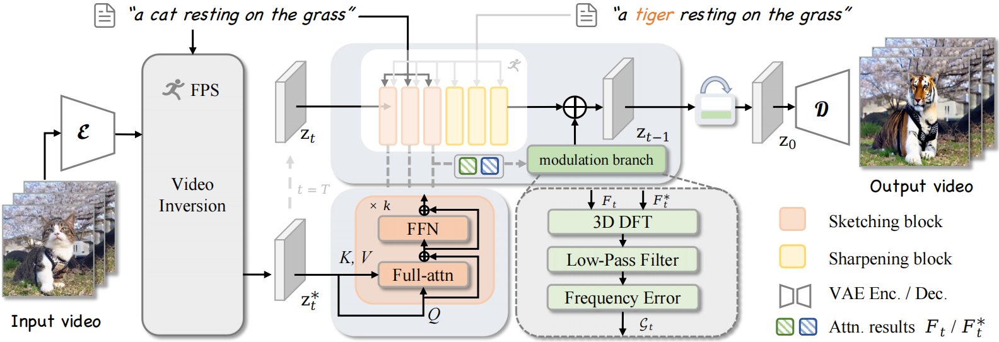

# FADE: Frequency-Aware Diffusion Model Factorization for Video Editing (CVPR 2025)

> [Yixuan Zhu](https://eternalevan.github.io/) , [Haolin Wang](https://howlin-wang.github.io/) , Shilin Ma, [Wenliang Zhao](https://wl-zhao.github.io/), [Yansong Tang](https://andytang15.github.io/), Jingxuan Niu, [Lei Chen](https://andytang15.github.io/) $\dagger$, [Jie Zhou](https://scholar.google.com/citations?user=6a79aPwAAAAJ&hl=en&authuser=1), [Jiwen Lu](http://ivg.au.tsinghua.edu.cn/Jiwen_Lu/)

[**[Paper]**](https://arxiv.org/pdf/2506.05934)

The repository contains the official implementation for the paper "FADE: Frequency-Aware Diffusion Model Factorization for Video Editing" (**CVPR 2025**).

We introduce FADE—a training-free yet highly effective video editing approach that fully leverages the inherent priors from pre-trained video diffusion models via frequency-aware factorization.

## 📋 To-Do List

* [] Release model and inference code.

## 💡 Pipeline

The code and demo will be coming soon!
