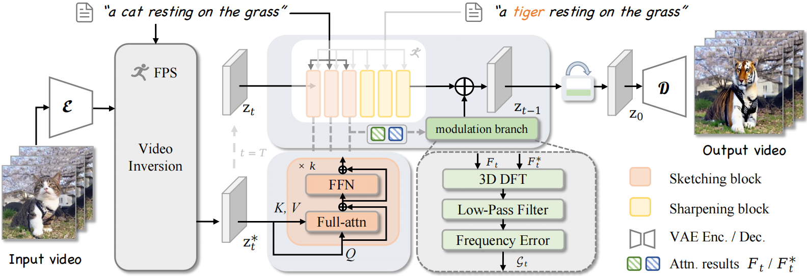

# FADE: Frequency-Aware Diffusion Model Factorization for Video Editing (CVPR 2025)

> [Yixuan Zhu](https://eternalevan.github.io/)\*, [Haolin Wang](https://howlin-wang.github.io/)\*, [Shilin Ma](https://github.com/cyp336/)\*, [Wenliang Zhao](https://wl-zhao.github.io/), [Yansong Tang](https://andytang15.github.io/), $\dagger$ [Jie Zhou](https://scholar.google.com/citations?user=6a79aPwAAAAJ&hl=en&authuser=1), $\dagger$
> 
> \* Equal contribution &nbsp; $\dagger$ Corresponding author

[**[Paper]**](https://arxiv.org/abs/2506.05934)

The repository contains the official implementation for the paper "FADE: Frequency-Aware Diffusion Model Factorization for Video Editing" (**CVPR 2025**).  
FADE, which refers to <ins>**F**</ins>requency-<ins>**A**</ins>ware <ins>**D**</ins>iffusion Model Factorization for Video <ins>**E**</ins>diting, is a training-free yet highly effective video editing approach that fully leverages the inherent priors from pre-trained video diffusion.

## :man_technologist: ToDo
- ☑️ Release the code for video editing
- ☑️ Release the paper

## :bulb: Pipeline


## :wrench: Installation
We recommend you to use an [Anaconda](https://www.anaconda.com/) virtual environment. If you have installed Anaconda, run the following commands to create and activate a virtual environment.
```bash
conda create --name FADE python=3.10
conda activate FADE
pip install -r requirements.txt
```
We use [Cogvideo-5B](https://huggingface.co/zai-org/CogVideoX-5b) as our foundation model, please download this model.
```bash
pip install huggingface_hub
huggingface-cli login
hf download zai-org/CogVideoX-5b
```
We utilize [HybridGL](https://github.com/fhgyuanshen/HybridGL) to generate mask used for editing, please clone this respository and set up the environment by running the following command.
```bash
cd HybridGL
python -m spacy download en_core_web_lg

cd third_party
cd modified_CLIP
pip install -e . --no-build-isolation

cd ..
cd segment-anything
pip install -e .
cd ../..
mkdir checkpoints 
cd checkpoints 
wget https://dl.fbaipublicfiles.com/segment_anything/sam_vit_h_4b8939.pth
```

## :arrow_forward: Running examples

Run editing with CogVideoX-5b: `bash edit_pipeline.sh`

## :rocket: Usage - your own examples

* Upload video to `input` folder. 

* Modify `edit_pipeline.sh`, especially `init_prompt`, `edit_prompt`, `input_video_path`, and other related parameters. <br>

* Create a config file by following the format of `configs/bear.yaml`. The trade-off between preservation and editing can be tuned by adjusting self_attn_gs. <br>

Run `bash edit_pipeline.sh`


## :key: License
This project is licensed under the [MIT License](LICENSE).


## :bookmark: Citation
If you use this code for your research, please cite our paper:

```
@misc{zhu2025fadefrequencyawarediffusionmodel,
      title={FADE: Frequency-Aware Diffusion Model Factorization for Video Editing}, 
      author={Yixuan Zhu and Haolin Wang and Shilin Ma and Wenliang Zhao and Yansong Tang and Lei Chen and Jie Zhou},
      year={2025},
      eprint={2506.05934},
      archivePrefix={arXiv},
      primaryClass={cs.CV},
      url={https://arxiv.org/abs/2506.05934}, 
}
```